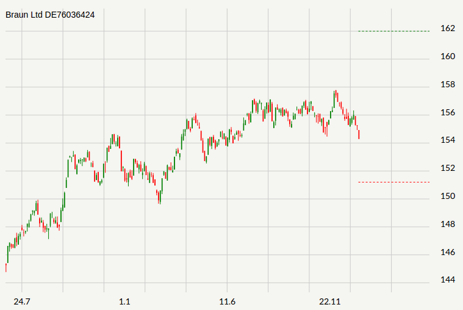

# Stock-Faker

Stock-Faker is a PHP library that generates stock fake data for you. Whether you need to bootstrap your database, create good-looking XML documents, fill-in your persistence to stress test it, or anonymize data taken from a production service, Stock-Faker is for you.

Stock-Faker requires PHP >= 5.3.3.

# Table of Contents

- [Installation](#installation)
- [Basic Usage](#basic-usage)
- [License](#license)


## Installation

```sh
composer require larsbadke/stock-faker
```

## Basic Usage

Use `StockFaker\Factory::create()` to create and initialize Stock-Faker, now you can generate data by accessing properties named after the type of data you want.

```php
<?php

// use the factory to create a StockFaker instance
$stock = StockFaker\Factory::create();

echo $stock->name;
// "Predovic LLC"
    
echo $stock->isin;
// "US0378331005"

echo $stock->close;
// '18.45'

echo $stock->open;
// "18.02"

echo $stock->low;
// '17.65'

echo $stock->high;
// "18.92" 

```

Stock key figures
```php
<?php

$stock = StockFaker\Factory::create();

echo $stock->variance;
// 4.56

echo $stock->mu;
// 3.45

```

#### Simulate stock movements

Single movement

```php
<?php

$stock = StockFaker\Factory::create();

echo $stock->close;
// "54.45"

$stock->next();

echo $stock->close;
// "55.45"
```

Complete movement like an impulse or a trend

```php
<?php

$stock = StockFaker\Factory::create();


for($i=0; $i<70; $i++){

    echo $stock->close;

    $stock->next();
}

// Generates random stock data

// 131.3 
// 132.68 
// 133.4 
// 134.45 
// 136.26 
// 137.89 
// 138.16 
// 138.87 
// 140.28 
// 142.38 
// ...

```



Manipulate drift and volatility

```php
<?php

$stock = StockFaker\Factory::create();

$stock->drift(0.01);

$stock->volatility(0.1);

for($i=0;$i<20;$i++){

    echo $stock->close.'<br>';

    $stock->next();
}


```

## License

Stock-Faker is released under the MIT Licence. See the bundled LICENSE file for details.
